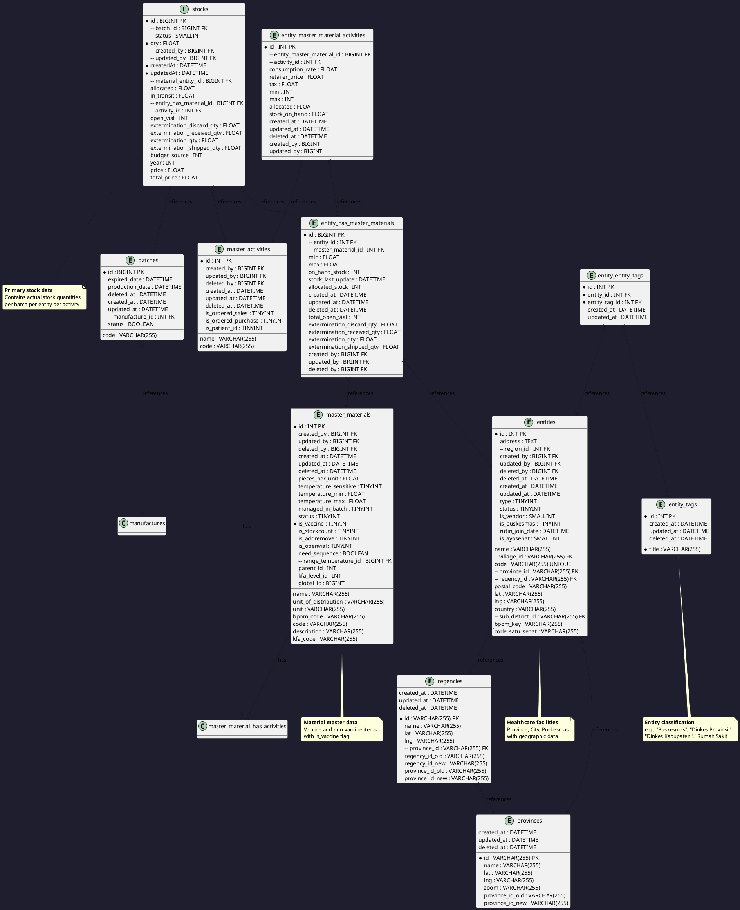
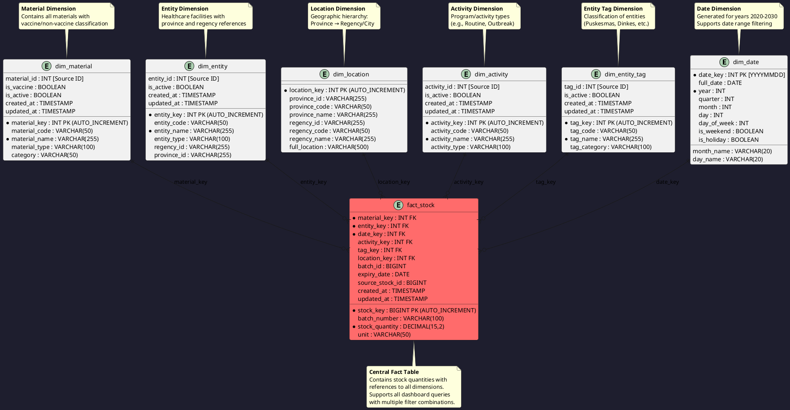

# Badr Interactive - Data Engineering Recruitment Project

## 📋 Project Overview

This project implements a complete data engineering solution for Indonesia's health logistics system dashboard. The system manages stock distribution across healthcare facilities (Dinas Kesehatan Provinsi, Kabupaten/Kota, and Puskesmas) for vaccine and non-vaccine materials.

### 🎯 Objectives

1. **Build ETL Pipeline** - Extract, transform, and load data from operational database to analytical datamart
2. **Design Data Mart** - Create dimensional model (star schema) optimized for OLAP queries
3. **Enable Dashboard Queries** - Provide efficient SQL queries supporting all dashboard requirements

### 🛠️ Technology Stack

| Component | Technology | Purpose |
|-----------|-----------|---------|
| **Source Database (OLTP)** | MySQL 8.0 | Operational database (recruitment_dev) |
| **Data Mart (OLAP)** | ClickHouse | Columnar database for analytics |
| **ETL Framework** | Python + Pandas | Data extraction and transformation |
| **Dashboard** | Apache Superset | BI and data visualization |
| **Containerization** | Docker Compose | Superset deployment |

---

## 🏗️ Architecture

### High-Level Data Flow

```
┌─────────────────────────────────────────┐
│   Source Database (OLTP - MySQL)       │
│   recruitment_dev @ 10.10.0.30:3306    │
│                                         │
│   • stocks                              │
│   • batches                             │
│   • master_materials                    │
│   • entities                            │
│   • entity_tags                         │
│   • provinces & regencies               │
│   • master_activities                   │
│   • entity_has_master_materials        │
│   • entity_master_material_activities  │
└──────────────┬──────────────────────────┘
               │
               │ Extract (Python + PyMySQL)
               │ Schedule: 4x/day or on-demand
               ▼
┌─────────────────────────────────────────┐
│         ETL Pipeline (Python)           │
│                                         │
│   1. Extract: Pull data from MySQL     │
│   2. Transform: Clean, join, aggregate │
│   3. Load: Insert into ClickHouse      │
└──────────────┬──────────────────────────┘
               │
               │ Load (clickhouse-driver)
               ▼
┌─────────────────────────────────────────┐
│      Data Mart (OLAP - ClickHouse)      │
│   localhost:9000 (Native)               │
│   localhost:8123 (HTTP)                 │
│                                         │
│   Star Schema:                          │
│   • dim_date                            │
│   • dim_material                        │
│   • dim_entity                          │
│   • dim_location                        │
│   • dim_activity                        │
│   • dim_entity_tag                      │
│   • fact_stock (central fact table)    │
└──────────────┬──────────────────────────┘
               │
               │ SQL Query (Superset)
               ▼
┌─────────────────────────────────────────┐
│      Apache Superset Dashboard          │
│   localhost:8088                        │
│                                         │
│   • Total Stock Card                    │
│   • Stock by Entity Tag (Bar Chart)    │
│   • Stock by Material (Bar Chart)      │
│   • Filter: Date, Location, Material   │
└─────────────────────────────────────────┘
```

---

## 📊 Source Database Schema (ERD)

### Core Tables for Stock Dashboard



---

## 🎯 Data Mart Schema (Star Schema)

### Dimensional Model



---

## 📁 Project Structure

```
requirement-badr_interactive/
├── 📄 README.md                          # This file
├── 📄 package.json                       # Node.js dependencies (Prisma)
├── 📄 prisma.config.ts                   # Prisma configuration
├── 📄 .env.example                       # Environment variables template
├── 📄 .gitignore                         # Git ignore rules
│
├── 📂 docs/
│   ├── 📄 PRD.md                         # Product Requirements Document
│   ├── 📄 ETL_DOCUMENTATION.md           # ETL process documentation
│   ├── 📄 DATAMART_DESIGN.md             # Data mart design document
│   └── 📄 SQL_QUERIES.md                 # SQL queries documentation
│
├── 📂 prisma/
│   └── 📄 schema.prisma                  # Prisma schema (source DB schema)
│
├── 📂 scripts/
│   ├── 📂 etl/
│   │   ├── 📄 extract.py                 # Data extraction scripts
│   │   ├── 📄 transform.py               # Data transformation scripts
│   │   ├── 📄 load.py                    # Data loading scripts
│   │   └── 📄 main.py                    # ETL orchestrator
│   │
│   ├── 📂 ddl/
│   │   ├── 📄 01_create_dimensions.sql   # Dimension tables DDL
│   │   ├── 📄 02_create_fact_table.sql   # Fact table DDL
│   │   ├── 📄 03_create_indexes.sql      # Index creation
│   │   └── 📄 04_populate_dim_date.sql   # Date dimension population
│   │
│   └── 📂 queries/
│       ├── 📄 dashboard_queries.sql      # Main dashboard queries
│       └── 📄 filter_queries.sql         # Filter dropdown queries
│
├── 📂 notebooks/
│   └── 📄 etl_exploration.ipynb          # Jupyter notebook for ETL demo
│
├── 📂 tests/
│   ├── 📄 test_etl.py                    # ETL unit tests
│   └── 📄 test_queries.py                # Query validation tests
│
└── 📂 data/                              # Sample data (if needed)
    └── 📄 .gitkeep
```

---

## 💡 Why ClickHouse + Superset?

### ClickHouse for OLAP Data Mart

**Advantages:**
1. **Columnar Storage** - 10-100x faster for analytical queries
2. **Massive Scalability** - Can handle billions of rows
3. **Real-time Analytics** - Supports both batch and streaming
4. **Excellent Compression** - 10x smaller than row-based databases
5. **SQL Compatible** - Standard SQL with extensions

**Performance Comparison:**
| Database | Query Type | Performance |
|----------|-----------|-------------|
| MySQL (Row-based) | Aggregation on 1M rows | ~2-5 seconds |
| ClickHouse (Columnar) | Aggregation on 1M rows | ~0.1-0.3 seconds |
| MySQL (Row-based) | Full table scan 10M rows | ~10-30 seconds |
| ClickHouse (Columnar) | Full table scan 10M rows | ~0.5-2 seconds |

### Apache Superset for Dashboard

**Advantages:**
1. **Open Source** - Free, no licensing costs
2. **Rich Visualizations** - 50+ chart types
3. **SQL IDE** - Built-in SQL Lab for query development
4. **No-code Explorer** - Business-friendly interface
5. **Multiple Databases** - Supports ClickHouse, MySQL, PostgreSQL, etc.
6. **Caching Layer** - Built-in Redis caching for performance
7. **Security** - Role-based access control

---

## 🚀 Getting Started

### Prerequisites

1. **OpenVPN Client**
   - Download from: https://openvpn.net/client/
   - Import the provided `.ovpn` file
   - Connect using credentials:
     - Username: `recruitment`
     - Password: `564738`

2. **Docker & Docker Compose**
   - Download from: https://www.docker.com/products/docker-desktop/
   - Required for running ClickHouse and Superset

3. **Python 3.9+**
   - Download from: https://www.python.org/downloads/

### Installation

#### Step 1: Start ClickHouse

```bash
# Start ClickHouse using Docker
docker run -d \
  --name clickhouse-badr \
  -p 8123:8123 -p 9000:9000 -p 9009:9009 \
  --ulimit nofile=262144:262144 \
  clickhouse/clickhouse-server:latest

# Verify ClickHouse is running
docker ps | grep clickhouse

# Test connection
curl http://localhost:8123/
# Should return: Ok.
```

#### Step 2: Create Data Mart Database and Tables

```bash
# Connect to ClickHouse
docker exec -it clickhouse-badr clickhouse-client

# Run DDL scripts
clickhouse-client --queries-file scripts/ddl/01_create_dimensions.sql
clickhouse-client --queries-file scripts/ddl/02_create_fact_table.sql
clickhouse-client --queries-file scripts/ddl/03_create_indexes.sql
```

#### Step 3: Setup Python Environment

```bash
# Create virtual environment
python -m venv venv

# Windows
venv\Scripts\activate

# Linux/Mac
source venv/bin/activate

# Install dependencies
pip install -r requirements.txt
```

#### Step 4: Configure Environment Variables

```bash
# Copy example env file
copy .env.example .env    # Windows
cp .env.example .env      # Linux/Mac

# Edit .env with your credentials
```

#### Step 5: Run ETL Pipeline

```bash
# Run full ETL (Extract from MySQL → Load to ClickHouse)
python scripts/etl/main.py

# Run with verbose logging
python scripts/etl/main.py --verbose
```

#### Step 6: Start Apache Superset

```bash
# Option 1: Using Docker Compose (recommended)
docker compose up -d

# Option 2: Using pip
pip install apache-superset
superset db upgrade
export FLASK_APP=superset
superset fab create-admin
superset load_examples
superset init
superset run -p 8088
```

**Access Superset:**
- URL: http://localhost:8088
- Default credentials: admin/admin

#### Step 7: Configure Superset Dashboard

1. **Add ClickHouse Database Connection:**
   - Go to Settings → Database Connections
   - Add new database
   - Connection string: `clickhouse://default:@localhost:8123/datamart_badr_interactive`

2. **Import Dashboard:**
   - Go to Dashboards → Import
   - Select `superset/dashboard_export.json`
   - Or manually create charts using SQL Lab

3. **Test Queries in SQL Lab:**
   ```sql
   SELECT 
       SUM(stock_quantity) AS total_stock
   FROM fact_stock
   WHERE date_key BETWEEN 20260101 AND 20260407;
   ```

---

## 💾 Database Configuration

### Source Database (OLTP - MySQL)

| Parameter | Value |
|-----------|-------|
| Host | `10.10.0.30` |
| Port | `3306` |
| Database | `recruitment_dev` |
| Username | `devel` |
| Password | `recruitment2024` |
| Access | VPN required |

### Data Mart Database (OLAP - ClickHouse)

| Parameter | Value |
|-----------|-------|
| Host | `localhost` |
| Port (HTTP) | `8123` |
| Port (Native) | `9000` |
| Database | `datamart_badr_interactive` |
| Username | `default` (or as configured) |
| Password | `` (empty by default) |
| Interface | HTTP / Native / gRPC |

### Apache Superset

| Parameter | Value |
|-----------|-------|
| URL | `http://localhost:8088` |
| Default User | `admin` |
| Default Password | `admin` |
| Database Connection | `clickhouse://default:@localhost:8123/datamart_badr_interactive` |

---

## 🔄 ETL Pipeline

### Overview

The ETL pipeline consists of three phases:

1. **Extract** - Pull data from source database tables
2. **Transform** - Clean, join, normalize, and aggregate
3. **Load** - Insert into data mart tables

### Execution

```bash
# Run full ETL
python scripts/etl/main.py

# Run specific phase
python scripts/etl/main.py --phase extract
python scripts/etl/main.py --phase transform
python scripts/etl/main.py --phase load

# Run with logging
python scripts/etl/main.py --verbose
```

### Data Flow

```
Source Tables                  Transformation                  Data Mart
─────────────                  ─────────────                    ─────────
stocks                         Join with batches              fact_stock
  ├─ batch_id                  Extract stock qty              ├─ stock_quantity
  ├─ entity_has_material_id    Map to date_key                ├─ date_key
  ├─ activity_id               Link to dimensions             ├─ material_key
  └─ qty                       Handle NULLs                   ├─ entity_key
                                Aggregate if needed            ├─ activity_key
batches                                                         └─ batch_id
  ├─ code
  └─ expired_date            Map entity to tags              dim_entity
                                Map province/regency         dim_location
master_materials               Classify vaccine/non-vaccine  dim_material
  ├─ name
  ├─ is_vaccine
  └─ code

entities                       Extract entity info           dim_entity
  ├─ name                      Map to location               ├─ entity_name
  ├─ province_id               Link to tags                  └─ province_id
  └─ regency_id
```

---

## 📊 Dashboard Queries

### 1. Total Stock (Jumlah Stok)

Calculates total stock quantity across all materials with applied filters.

```sql
SELECT COALESCE(SUM(fs.stock_quantity), 0) AS total_stock
FROM fact_stock fs
INNER JOIN dim_material dm ON fs.material_key = dm.material_key
INNER JOIN dim_location dl ON fs.location_key = dl.location_key
WHERE fs.date_key BETWEEN :date_from AND :date_to
  AND (:material_type IS NULL OR dm.category = :material_type)
  AND (:province IS NULL OR dl.province_id = :province);
```

### 2. Stock by Entity Tag (Stok per Tag Entitas)

Shows stock distribution by entity type (Puskesmas, Dinkes, etc.).

```sql
SELECT 
    det.tag_name,
    COUNT(DISTINCT fs.entity_key) AS entity_count,
    SUM(fs.stock_quantity) AS total_stock
FROM fact_stock fs
INNER JOIN dim_entity_tag det ON fs.tag_key = det.tag_key
GROUP BY det.tag_key, det.tag_name
ORDER BY total_stock DESC;
```

### 3. Stock by Material (Stok per Material)

Shows stock distribution for each material.

```sql
SELECT 
    dm.material_name,
    dm.category,
    SUM(fs.stock_quantity) AS total_stock,
    COUNT(DISTINCT fs.entity_key) AS entity_count
FROM fact_stock fs
INNER JOIN dim_material dm ON fs.material_key = dm.material_key
GROUP BY dm.material_key, dm.material_name, dm.category
ORDER BY total_stock DESC;
```

---

## 🧪 Testing

### Run Tests

```bash
# Test ETL pipeline
python -m pytest tests/test_etl.py -v

# Test queries
python -m pytest tests/test_queries.py -v

# Run all tests
python -m pytest tests/ -v
```

### Data Validation

Key validation checks:

1. **Row counts** - Source vs Data mart
2. **Aggregations** - Sum of stock quantities match
3. **Referential integrity** - All foreign keys valid
4. **Filter accuracy** - Queries return correct results with filters

---

## 📝 Documentation

Detailed documentation is available in the `docs/` folder:

- **[PRD.md](docs/PRD.md)** - Complete Product Requirements Document
- **[ETL_DOCUMENTATION.md](docs/ETL_DOCUMENTATION.md)** - ETL process documentation
- **[DATAMART_DESIGN.md](docs/DATAMART_DESIGN.md)** - Data mart design document
- **[SQL_QUERIES.md](docs/SQL_QUERIES.md)** - SQL queries documentation

---

## 🔒 Security Notes

1. **Never commit `.env` file** - It contains database credentials
2. **VPN required** - Source database is only accessible via VPN
3. **Use read-only access** for source database when possible
4. **Data mart should be isolated** from production systems

---

## 🛠️ Technology Stack

| Component | Technology | Version |
|-----------|-----------|---------|
| ETL Framework | Python + Pandas | 3.9+, 2.0+ |
| Source Database | MySQL | 8.0+ |
| Data Mart Database | MySQL | 8.0+ |
| ORM (Source schema) | Prisma | Latest |
| Data Visualization | (Dashboard - not included) | - |
| Version Control | Git | - |
| Containerization | Docker (optional) | - |

---

## 📈 Performance Considerations

### Indexing Strategy

All foreign keys in `fact_stock` are indexed:
- `idx_material_key`
- `idx_entity_key`
- `idx_date_key`
- `idx_activity_key`
- `idx_tag_key`
- `idx_location_key`

### Query Optimization

- Use `EXPLAIN` to analyze query plans
- Avoid `SELECT *` - only select needed columns
- Use date range filters to limit data scanned
- Consider partitioning `fact_stock` by date if data grows large

---

## 🤝 Contributing

This is a recruitment project. For reference purposes only.

---

## 📞 Support

For questions about this project, refer to the recruitment requirements or contact Badr Interactive.

---

## 📄 License

This project is created for recruitment purposes.

---

## 👤 Author

**Data Engineer Candidate** - Badr Interactive Recruitment Process

---

## 🎉 Acknowledgments

- Badr Interactive for the opportunity
- Source database provided for recruitment test

---

**Last Updated:** April 7, 2026
