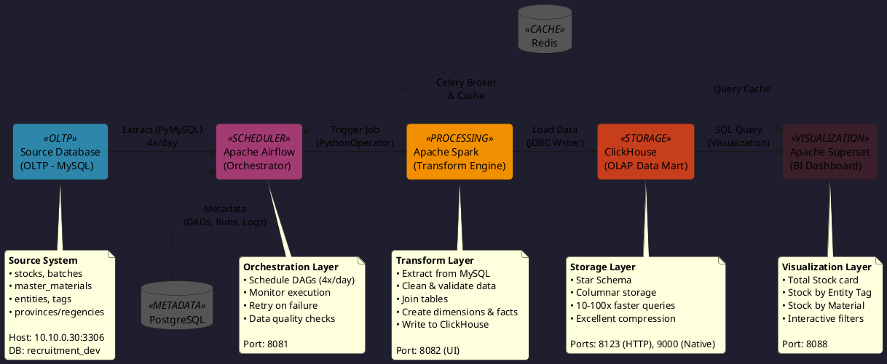
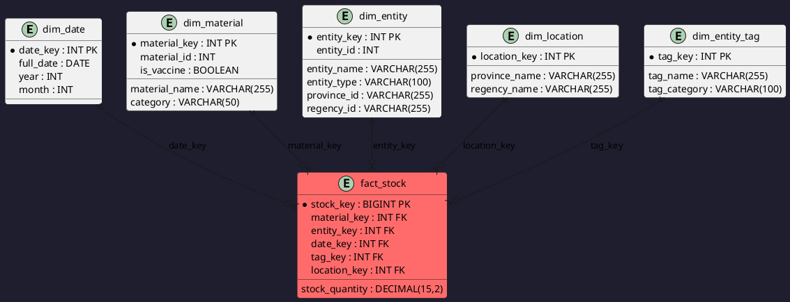

# Badr Interactive - Data Engineering Recruitment

## 📋 Project Overview

Data pipeline untuk dashboard stok logistik kesehatan Indonesia (Dinkes Provinsi, Kabupaten/Kota, Puskesmas).

### 🎯 Objectives

1. **ETL Pipeline** - Extract, transform, load dari MySQL ke ClickHouse
2. **Data Mart** - Star schema untuk analisis OLAP
3. **Dashboard** - Visualisasi stok di Superset

### 🛠️ Tech Stack

| Component | Technology |
|-----------|-----------|
| **Source DB** | MySQL (recruitment_dev @ 10.10.0.30) |
| **Data Mart** | ClickHouse (Columnar OLAP) |
| **Orchestrator** | Apache Airflow |
| **Transform** | Apache Spark (PySpark) |
| **Dashboard** | Apache Superset |
| **Deploy** | Docker Compose |

---

## 🏗️ Architecture

### High-Level Data Flow

```
MySQL (Source) → Airflow (Scheduler) → Spark (Transform) → ClickHouse (OLAP) → Superset (Dashboard)
  :3306              :8081                 :8082               :8123/:9000          :8088
```

### Architecture Diagram



### Data Mart Schema (Star Schema)



### Dimension Tables

| Table | Purpose | Source |
|-------|---------|--------|
| `dim_date` | Time analysis (year, month, day) | Generated (2020-2030) |
| `dim_material` | Vaccine/Non-vaccine items | master_materials |
| `dim_entity` | Healthcare facilities | entities |
| `dim_location` | Province → Regency hierarchy | provinces + regencies |
| `dim_activity` | Program/activity types | master_activities |
| `dim_entity_tag` | Entity classification (Puskesmas, Dinkes) | entity_tags |

### Fact Table

| Table | Purpose | Grain |
|-------|---------|-------|
| `fact_stock` | Stock quantities with dimension FKs | One row per stock record per batch per entity per day |

**Key Columns:**
- `stock_quantity` - Main metric (remaining stock)
- `allocated`, `in_transit` - Additional stock metrics
- `material_key`, `entity_key`, `date_key` - Required FKs
- `tag_key`, `location_key`, `activity_key` - Optional FKs

---

## 🚀 Quick Start

### 1. Prerequisites
- **OpenVPN** (connect ke: user=`recruitment`, pass=`564738`)
- **Docker Desktop** installed & running
- **Python 3.9+**

### 2. Start Services
```bash
# Copy & edit env
copy .env.example .env    # Windows
cp .env.example .env      # Linux/Mac

# Start all services
docker compose up -d
```

### 3. Access UIs
| Service | URL | Credentials |
|---------|-----|-------------|
| **Airflow** | http://localhost:8081 | airflow / airflow |
| **Spark UI** | http://localhost:8082 | No auth |
| **Superset** | http://localhost:8088 | admin / admin |

### 4. Initialize Data Mart
```bash
# Run DDL scripts in ClickHouse
docker exec -i clickhouse-badr clickhouse-client --queries-file scripts/ddl/01_create_dimensions_ch.sql
docker exec -i clickhouse-badr clickhouse-client --queries-file scripts/ddl/02_create_fact_table_ch.sql
```

### 5. Run ETL Pipeline
**Via Airflow UI:**
1. Go to http://localhost:8081
2. Find DAG: `stock_etl_pipeline`
3. Click "Trigger DAG"

**Manual (Testing):**
```bash
python dags/jobs/jobs_etl.py \
  --source_type mysql --source_host 10.10.0.30 --source_port 3306 \
  --source_user devel --source_password recruitment2024 \
  --source_db recruitment_dev \
  --target_type clickhouse --target_host localhost --target_port 8123 \
  --target_user default --target_password "" \
  --target_db datamart_badr_interactive
```

### 6. Configure Superset
1. **Add ClickHouse:**
   - Settings → Database Connections → + Database
   - SQLAlchemy URI: `clickhouse://default:@localhost:8123/datamart_badr_interactive`

2. **Create Charts:**
   - See [Dashboard Charts](#-dashboard-charts) section below

---

## 🔄 ETL Pipeline

### Airflow DAG Schedule

| Task | Frequency | Time |
|------|-----------|------|
| Stock ETL | 4x/day | 00:00, 06:00, 12:00, 18:00 |
| Master Data Sync | 1x/day | 01:00 |

### ETL Process Flow

```
┌─────────────────────────────────────────────────────────────┐
│                  Extract Phase (extract.py)                  │
│  • Connect to MySQL (recruitment_dev)                       │
│  • Query: stocks, batches, materials, entities, etc.        │
│  • Filter: deleted_at IS NULL                               │
│  • Load to Pandas DataFrames                                │
└──────────────────┬──────────────────────────────────────────┘
                   ▼
┌─────────────────────────────────────────────────────────────┐
│               Transform Phase (transform.py)                 │
│  • Clean & standardize data                                 │
│  • Join tables (stocks + batches + entities + materials)    │
│  • Create derived fields (category, entity_type)            │
│  • Map source IDs to business keys                          │
└──────────────────┬──────────────────────────────────────────┘
                   ▼
┌─────────────────────────────────────────────────────────────┐
│                  Load Phase (load.py)                        │
│  • Connect to ClickHouse                                    │
│  • Load dimension tables (upsert logic)                     │
│  • Map surrogate keys for fact table                        │
│  • Load fact_stock with batch inserts                       │
│  • Validate loaded data                                     │
└─────────────────────────────────────────────────────────────┘
```

### Dockerfile.airflow

```dockerfile
FROM apache/airflow:3.0.6

USER root
RUN apt-get update && \
    apt-get install -y --no-install-recommends default-jre-headless && \
    apt-get clean && rm -rf /var/lib/apt/lists/*

USER airflow
RUN pip install --no-cache-dir \
    clickhouse-driver==0.2.6 clickhouse-connect==0.7.0 \
    pymysql==1.1.0 pandas==2.2.0 numpy==1.26.3 pyspark==3.5.0 \
    python-dotenv==1.0.1 tqdm==4.66.1
```

### Required Directories
```bash
# Windows
mkdir dags\jobs\scripts

# Linux/Mac
mkdir -p dags/jobs/scripts
```

---

## 💾 Database Configuration

### Source Database (OLTP - MySQL)
| Parameter | Value |
|-----------|-------|
| Host | `10.10.0.30` |
| Port | `3306` |
| Database | `recruitment_dev` |
| Username | `devel` |
| Password | `recruitment2024` |
| Access | VPN required |

### Data Mart Database (OLAP - ClickHouse)
| Parameter | Value |
|-----------|-------|
| Host | `localhost` |
| HTTP Port | `8123` |
| Native Port | `9000` |
| Database | `datamart_badr_interactive` |
| Username | `default` |
| Password | *(empty)* |

---

## 📁 Project Structure

```
requirement-badr_interactive/
├── docker-compose.yml          # Airflow + Spark + ClickHouse + Superset
├── Dockerfile.airflow          # Custom Airflow image
├── requirements.txt            # Python deps
├── .env.example                # Env template
│
├── dags/
│   ├── dags_etl.py             # Airflow DAG definition
│   └── jobs/
│       ├── jobs_etl.py         # Main ETL script (PySpark)
│       └── scripts/
│           ├── helpers.py      # JDBC helpers
│           └── methods.py      # ETL methods
│
├── scripts/
│   ├── ddl/                    # ClickHouse DDL scripts
│   │   ├── 01_create_dimensions_ch.sql
│   │   └── 02_create_fact_table_ch.sql
│   └── queries/                # Dashboard SQL queries
│       ├── dashboard_queries.sql
│       └── filter_queries.sql
│
└── prisma/schema.prisma        # Source DB reference
```

---

## 📊 Dashboard Queries

### 1. Total Stock (Jumlah Stok)
```sql
SELECT COALESCE(SUM(fs.stock_quantity), 0) AS total_stock,
       COUNT(DISTINCT fs.material_key) AS material_count,
       COUNT(DISTINCT fs.entity_key) AS entity_count
FROM fact_stock fs
WHERE fs.date_key BETWEEN :date_from AND :date_to
  AND (:material_type IS NULL OR dm.category = :material_type)
  AND (:province_id IS NULL OR dl.province_id = :province_id);
```

### 2. Stock by Entity Tag (Stok per Tag Entitas)
```sql
SELECT det.tag_name, det.tag_category,
       COUNT(DISTINCT fs.entity_key) AS entity_count,
       SUM(fs.stock_quantity) AS total_stock
FROM fact_stock fs
INNER JOIN dim_entity_tag det ON fs.tag_key = det.tag_key
WHERE fs.date_key BETWEEN :date_from AND :date_to
GROUP BY det.tag_key, det.tag_name, det.tag_category
ORDER BY total_stock DESC;
```

### 3. Stock by Material (Stok per Material)
```sql
SELECT dm.material_name, dm.category, dm.is_vaccine,
       COUNT(DISTINCT fs.entity_key) AS entity_count,
       SUM(fs.stock_quantity) AS total_stock
FROM fact_stock fs
INNER JOIN dim_material dm ON fs.material_key = dm.material_key
WHERE fs.date_key BETWEEN :date_from AND :date_to
GROUP BY dm.material_key, dm.material_name, dm.category, dm.is_vaccine
ORDER BY total_stock DESC;
```

### 4. Stock Trend Over Time
```sql
SELECT dd.full_date, dd.year, dd.month,
       SUM(fs.stock_quantity) AS total_stock
FROM fact_stock fs
INNER JOIN dim_date dd ON fs.date_key = dd.date_key
WHERE dd.full_date >= today() - toIntervalDay(90)
GROUP BY dd.full_date, dd.year, dd.month
ORDER BY dd.full_date ASC;
```

### 5. Vaccine vs Non-Vaccine
```sql
SELECT dm.category, SUM(fs.stock_quantity) AS total_stock
FROM fact_stock fs
INNER JOIN dim_material dm ON fs.material_key = dm.material_key
GROUP BY dm.category ORDER BY total_stock DESC;
```

### Filter Queries
```sql
-- Materials dropdown
SELECT DISTINCT material_key, material_name, category FROM dim_material ORDER BY material_name;

-- Entity tags dropdown
SELECT DISTINCT tag_key, tag_name, tag_category FROM dim_entity_tag ORDER BY tag_name;

-- Provinces dropdown
SELECT DISTINCT province_id, province_name FROM dim_location ORDER BY province_name;

-- Regencies dropdown (filtered by province)
SELECT DISTINCT regency_id, regency_name FROM dim_location 
WHERE province_id = :province_id ORDER BY regency_name;
```

---

## 📊 Dashboard Charts (Superset)

### Chart 1: Total Stock (Big Number)
- **Type:** Big Number
- **Metric:** `SUM(stock_quantity)`
- **Title:** "Jumlah Stok"

### Chart 2: Stock by Entity Tag (Bar Chart)
- **Type:** Bar Chart
- **Query:** Stock by Entity Tag (above)
- **X:** tag_name, **Y:** total_stock

### Chart 3: Stock by Material (Horizontal Bar)
- **Type:** Horizontal Bar Chart
- **Query:** Stock by Material (above)
- **X:** total_stock, **Y:** material_name
- **Group By:** category

### Chart 4: Stock Trend (Line Chart)
- **Type:** Line Chart
- **Query:** Stock Trend Over Time (above)
- **X:** full_date, **Y:** total_stock

### Chart 5: Vaccine vs Non-Vaccine (Pie)
- **Type:** Pie Chart
- **Query:** Vaccine vs Non-Vaccine (above)
- **Group By:** category, **Metric:** total_stock

### Dashboard Layout
```
┌─────────────────────────────────────────────────────────┐
│  [Filter Bar]                                           │
│  Date Range | Province | Material Type | Entity Tag    │
└─────────────────────────────────────────────────────────┘

┌──────────────────┐ ┌──────────────────┐ ┌──────────────────┐
│  Jumlah Stok     │ │  Vaccine vs      │ │  Active Entities │
│  (Big Number)    │ │  Non-Vaccine     │ │  (Big Number)    │
└──────────────────┘ └──────────────────┘ └──────────────────┘

┌──────────────────────────────────────────────────────────┐
│  Stok per Tag Entitas (Bar Chart)                        │
└──────────────────────────────────────────────────────────┘

┌─────────────────────────────────────┐ ┌──────────────────┐
│  Stok per Material (Bar Chart)      │ │  Top 10 Entities │
│                                     │ │  (Table)         │
└─────────────────────────────────────┘ └──────────────────┘

┌──────────────────────────────────────────────────────────┐
│  Stock Trend Over Time (Line Chart)                      │
└──────────────────────────────────────────────────────────┘
```

---

## 🐛 Troubleshooting

### Airflow not starting
```bash
docker logs airflow-init
docker compose down -v
docker compose up -d
```

### ClickHouse connection refused
```bash
docker logs clickhouse-badr
# Wait for: "Ready for connections"
curl http://localhost:8123/ping  # Should return: Ok.
```

### Out of Memory
```bash
docker stats
docker compose stop spark-master  # Stop Spark if needed
```

---

## 📈 Performance

| Metric | MySQL | ClickHouse | Improvement |
|--------|-------|------------|-------------|
| 1M rows aggregation | 2-5s | 0.1-0.3s | **15-20x faster** |
| 10M rows full scan | 10-30s | 0.5-2s | **15x faster** |
| Storage | 100% | 10-20% | **80-90% smaller** |

---

## 🔒 Security
- ✅ Never commit `.env`
- ✅ VPN required for source DB
- ✅ Use read-only access for source
- ✅ Data mart isolated from production

---

## ✅ Checklist

- [ ] VPN connected
- [ ] Docker Desktop running
- [ ] `.env` configured
- [ ] `docker compose up -d` executed
- [ ] All services healthy
- [ ] Dockerfile.airflow built
- [ ] Directories created (airflow/, spark/)
- [ ] Data mart initialized (DDL scripts)
- [ ] ETL triggered via Airflow
- [ ] Data visible in ClickHouse
- [ ] Superset dashboard created

---

**Last Updated:** April 7, 2026  
**Status:** ✅ Ready - Airflow + Spark + ClickHouse + Superset
