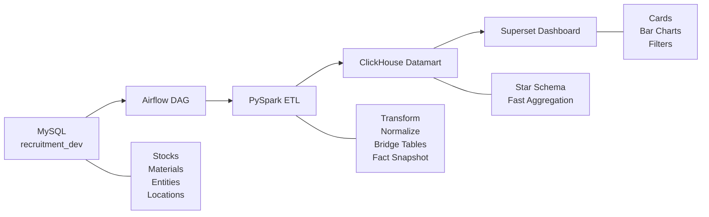
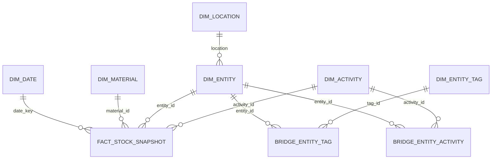

# Laporan Rekrutmen Data Engineer
## Badr Interactive

Repositori GitHub: [https://github.com/wildan14ar/Requirement-Badr_Interactive](https://github.com/wildan14ar/Requirement-Badr_Interactive)

## Daftar Isi
- [Ringkasan Eksekutif](#ringkasan-eksekutif)
- [BAB I. Pendahuluan](#bab-i-pendahuluan)
  - [1.1 Latar Belakang](#11-latar-belakang)
  - [1.2 Tujuan](#12-tujuan)
  - [1.3 Ruang Lingkup](#13-ruang-lingkup)
- [BAB II. Arsitektur Solusi](#bab-ii-arsitektur-solusi)
  - [2.1 Arsitektur Tingkat Tinggi](#21-arsitektur-tingkat-tinggi)
  - [2.2 Komponen Sistem](#22-komponen-sistem)
  - [2.3 Alur Data](#23-alur-data)
- [BAB III. Dokumentasi ETL](#bab-iii-dokumentasi-etl)
  - [3.1 Sumber Data](#31-sumber-data)
  - [3.2 Proses Extract](#32-proses-extract)
  - [3.3 Proses Transform](#33-proses-transform)
  - [3.4 Proses Load](#34-proses-load)
  - [3.5 Implementasi](#35-implementasi)
- [BAB IV. Desain Datamart OLAP](#bab-iv-desain-datamart-olap)
  - [4.1 Model Data](#41-model-data)
  - [4.2 Tabel Dimensi](#42-tabel-dimensi)
  - [4.3 Tabel Bridge](#43-tabel-bridge)
  - [4.4 Tabel Fakta](#44-tabel-fakta)
- [BAB V. Query SQL Dashboard](#bab-v-query-sql-dashboard)
  - [5.1 Query Jumlah Stok](#51-query-jumlah-stok)
  - [5.2 Query Stok per Tag Entitas](#52-query-stok-per-tag-entitas)
  - [5.3 Query Stok per Material](#53-query-stok-per-material)
  - [5.4 Query Filter](#54-query-filter)
- [Penutup](#penutup)

## Ringkasan Eksekutif
Dokumen ini merangkum rancangan end-to-end untuk membangun dashboard stok logistik kesehatan Indonesia. Solusi yang diusulkan memindahkan data operasional dari MySQL ke datamart OLAP ClickHouse melalui pipeline ETL berbasis PySpark dan Airflow.

Hasil akhir dirancang agar dashboard dapat menampilkan jumlah stok, stok per tag entitas, dan stok per material dengan cepat, konsisten, serta mudah dipelihara.

## BAB I. Pendahuluan

### 1.1 Latar Belakang
Sistem logistik kesehatan digunakan oleh fasilitas kesehatan di Indonesia mulai dari Dinas Kesehatan Provinsi, Dinas Kesehatan Kabupaten/Kota, hingga Puskesmas. Sistem ini menyimpan data stok material seperti vaksin dan non-vaksin yang perlu disajikan dalam dashboard analitik.

### 1.2 Tujuan
Tujuan dokumen ini adalah menjelaskan rancangan ETL, desain datamart OLAP, dan query SQL yang mendukung dashboard stok sesuai kebutuhan bisnis.

### 1.3 Ruang Lingkup
Ruang lingkup solusi ini adalah:
- Fokus pada `Sisa Stok`.
- Mengabaikan `Tanggal Kadaluarsa`.
- Mengabaikan `Stok Belum Diterima`.
- Mendukung filter tanggal, kegiatan, jenis material, nama material, tag entitas, dan lokasi.

## BAB II. Arsitektur Solusi

### 2.1 Arsitektur Tingkat Tinggi


### 2.2 Komponen Sistem
| Komponen | Peran |
|---|---|
| MySQL `recruitment_dev` | Sumber data operasional |
| Airflow | Orkestrasi dan penjadwalan pipeline |
| PySpark | Ekstraksi, transformasi, dan pemuatan data |
| ClickHouse | Datamart OLAP dan agregasi cepat |
| Superset | Dashboard dan eksplorasi visual |

### 2.3 Alur Data
Alur data mengikuti pola berikut:
1. Data dibaca dari tabel sumber MySQL.
2. Data dibersihkan dan dinormalisasi menggunakan PySpark.
3. Data dimuat ke struktur OLAP berbasis star schema di ClickHouse.
4. Dashboard membaca data langsung dari datamart.

## BAB III. Dokumentasi ETL

### 3.1 Sumber Data
Tabel source yang digunakan:
- `stocks`
- `batches`
- `entity_has_master_materials`
- `entities`
- `master_materials`
- `master_activities`
- `entity_tags`
- `entity_entity_tags`
- `entity_activity_date`
- `provinces`
- `regencies`

### 3.2 Proses Extract
Proses extract mengambil data dari MySQL `recruitment_dev` melalui JDBC. Data utama yang dibutuhkan adalah stok, master material, master aktivitas, entitas, tag entitas, dan wilayah.

### 3.3 Proses Transform
Aturan transformasi yang diterapkan:
- Material dipetakan menjadi `Vaccine` atau `Non-Vaccine`.
- `entities.type` dipetakan ke label bisnis seperti Dinas Kesehatan, Puskesmas, Rumah Sakit, dan lain-lain.
- `stocks.createdAt` diubah menjadi `stock_date` dan `date_key`.
- Relasi many-to-many dibentuk menjadi bridge table:
  - `bridge_entity_tag`
  - `bridge_entity_activity`
- Data soft-deleted diabaikan jika kolom `deleted_at` tersedia.

### 3.4 Proses Load
Urutan load ke datamart:
1. `dim_date`
2. `dim_location`
3. `dim_material`
4. `dim_entity`
5. `dim_activity`
6. `dim_entity_tag`
7. `bridge_entity_tag`
8. `bridge_entity_activity`
9. `fact_stock_snapshot`

### 3.5 Implementasi
File utama implementasi ETL:
- [dags/jobs/jobs_etl.py](dags/jobs/jobs_etl.py)

DDL datamart:
- [scripts/ddl/create_datamart_clickhouse.sql](scripts/ddl/create_datamart_clickhouse.sql)

Contoh perintah menjalankan ETL manual:
```bash
python dags/jobs/jobs_etl.py \
  --source_type mysql --source_host 10.10.0.30 --source_port 3306 \
  --source_user devel --source_password recruitment2024 \
  --source_db recruitment_dev \
  --target_type clickhouse --target_host localhost --target_port 8123 \
  --target_user default --target_password "" \
  --target_db datamart_badr_interactive
```

## BAB IV. Desain Datamart OLAP

### 4.1 Model Data
Datamart menggunakan star schema dengan bridge table untuk relasi many-to-many.



### 4.2 Tabel Dimensi
- `dim_date`: satu baris per tanggal.
- `dim_location`: satu baris per pasangan provinsi dan kabupaten/kota.
- `dim_material`: satu baris per material.
- `dim_entity`: satu baris per fasilitas kesehatan.
- `dim_activity`: satu baris per kegiatan.
- `dim_entity_tag`: satu baris per tag entitas.

### 4.3 Tabel Bridge
- `bridge_entity_tag`: mapping entitas ke tag.
- `bridge_entity_activity`: mapping entitas ke kegiatan.

### 4.4 Tabel Fakta
- `fact_stock_snapshot`: satu baris per record stok sumber.
- Metric utama: `stock_quantity`.
- Foreign key analitik: `date_key`, `entity_id`, `material_id`, `activity_id`.

## BAB V. Query SQL Dashboard

### 5.1 Query Jumlah Stok
```sql
SELECT COALESCE(SUM(fs.stock_quantity), 0) AS total_stock
FROM fact_stock_snapshot fs
LEFT JOIN dim_material dm ON fs.material_id = dm.material_id
LEFT JOIN dim_entity de ON fs.entity_id = de.entity_id
WHERE fs.stock_date BETWEEN :date_from AND :date_to
  AND (:activity_id IS NULL OR fs.activity_id = :activity_id)
  AND (:material_type IS NULL OR dm.category = :material_type)
  AND (:material_id IS NULL OR fs.material_id = :material_id)
  AND (
      :tag_id IS NULL
      OR EXISTS (
          SELECT 1
          FROM bridge_entity_tag bet_filter
          WHERE bet_filter.entity_id = fs.entity_id
            AND bet_filter.tag_id = :tag_id
      )
  )
  AND (:province_id IS NULL OR de.province_id = :province_id)
  AND (:regency_id IS NULL OR de.regency_id = :regency_id)
  AND (:entity_type IS NULL OR de.entity_type = :entity_type)
  AND (:information_type IS NULL OR :information_type = 'Sisa Stok');
```

### 5.2 Query Stok per Tag Entitas
```sql
SELECT
    det.tag_id,
    det.tag_name,
    COUNT(DISTINCT fs.entity_id) AS entity_count,
    SUM(fs.stock_quantity) AS total_stock
FROM fact_stock_snapshot fs
JOIN bridge_entity_tag bet ON fs.entity_id = bet.entity_id
JOIN dim_entity_tag det ON bet.tag_id = det.tag_id
LEFT JOIN dim_material dm ON fs.material_id = dm.material_id
LEFT JOIN dim_entity de ON fs.entity_id = de.entity_id
WHERE fs.stock_date BETWEEN :date_from AND :date_to
  AND (:activity_id IS NULL OR fs.activity_id = :activity_id)
  AND (:material_type IS NULL OR dm.category = :material_type)
  AND (:material_id IS NULL OR fs.material_id = :material_id)
  AND (:tag_id IS NULL OR bet.tag_id = :tag_id)
  AND (:province_id IS NULL OR de.province_id = :province_id)
  AND (:regency_id IS NULL OR de.regency_id = :regency_id)
  AND (:entity_type IS NULL OR de.entity_type = :entity_type)
GROUP BY det.tag_id, det.tag_name
ORDER BY total_stock DESC, det.tag_name;
```

### 5.3 Query Stok per Material
```sql
SELECT
    dm.material_id,
    dm.material_name,
    dm.category,
    dm.is_vaccine,
    COUNT(DISTINCT fs.entity_id) AS entity_count,
    SUM(fs.stock_quantity) AS total_stock
FROM fact_stock_snapshot fs
JOIN dim_material dm ON fs.material_id = dm.material_id
LEFT JOIN dim_entity de ON fs.entity_id = de.entity_id
WHERE fs.stock_date BETWEEN :date_from AND :date_to
  AND (:activity_id IS NULL OR fs.activity_id = :activity_id)
  AND (:material_type IS NULL OR dm.category = :material_type)
  AND (:material_id IS NULL OR fs.material_id = :material_id)
  AND (
      :tag_id IS NULL
      OR EXISTS (
          SELECT 1
          FROM bridge_entity_tag bet_filter
          WHERE bet_filter.entity_id = fs.entity_id
            AND bet_filter.tag_id = :tag_id
      )
  )
  AND (:province_id IS NULL OR de.province_id = :province_id)
  AND (:regency_id IS NULL OR de.regency_id = :regency_id)
  AND (:entity_type IS NULL OR de.entity_type = :entity_type)
GROUP BY dm.material_id, dm.material_name, dm.category, dm.is_vaccine
ORDER BY total_stock DESC, dm.material_name;
```

### 5.4 Query Filter
```sql
SELECT material_id, material_name, category, is_vaccine FROM dim_material ORDER BY material_name;
SELECT activity_id, activity_name FROM dim_activity ORDER BY activity_name;
SELECT tag_id, tag_name FROM dim_entity_tag ORDER BY tag_name;
SELECT DISTINCT province_id, province_name FROM dim_location ORDER BY province_name;
SELECT DISTINCT regency_id, regency_name FROM dim_location WHERE province_id = :province_id ORDER BY regency_name;
SELECT DISTINCT entity_type FROM dim_entity ORDER BY entity_type;
```

## Penutup
Rancangan ini disusun agar dapat langsung dipresentasikan pada tahap interview sebagai solusi data engineering yang terstruktur, formal, dan sesuai kebutuhan dashboard stok logistik.
